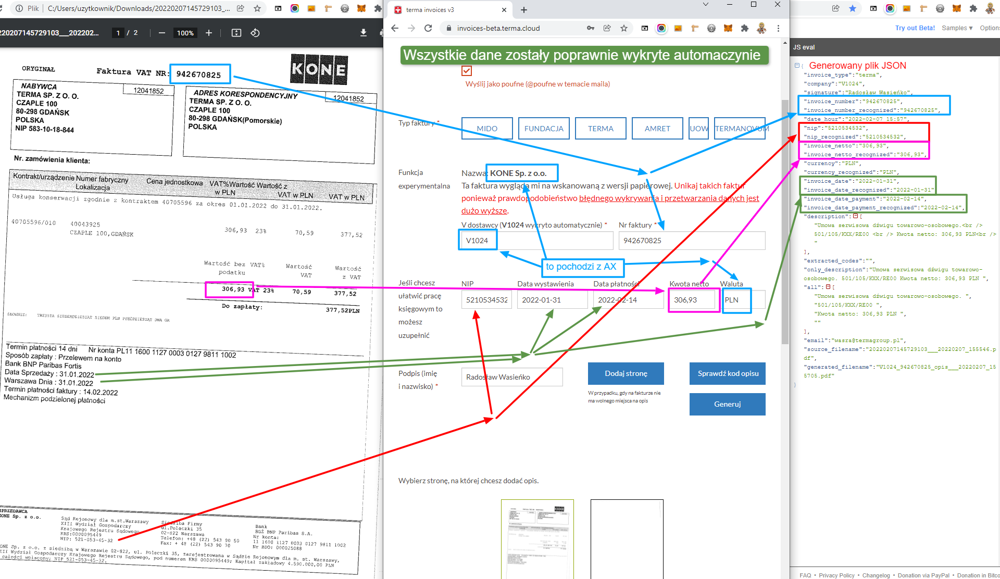

# Portfolio

### Invoice Recognition System

Terma company processes about 100 cost invoices per day. I wrote a system that reads data from scanned invoices and saves everything to JSON files to load everything into the ERP system in the next step.

[Access the system here](https://invoices.terma.cloud)

**Technology:**  
[Tesseract-ocr](https://github.com/tesseract-ocr/tesseract), PHP, SQL, Bootstrap, OVH Cloud

